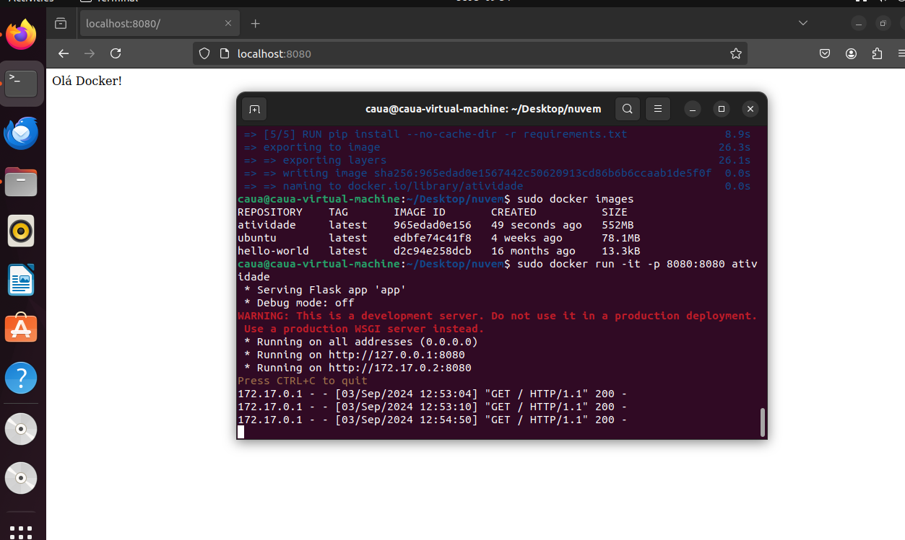

Etapas do trabalho

## 1 - Criação do arquivo app.py:

o app.py é um exemplo simples de python com Flask, onde ele retorna a string "Olá Docker!", e abre a rota no localhost na porta 8080

## 2- Salvando requerimentos do projeto

para salvar somente as bibliotecas python que são necessárias, foi instalado o pipreqs e usado o comando "pipreqs ." , assim gerando o requirements.txt sem todas as bibliotecas instaladas e sim só as necessárias

## 3- Criação do Dockerfile

o arquivo docker file usa imagem ubuntu, roda um apt-get update para atualizar libs e em seguida as instalações do python necessárias para o app.py, abre o diretório de trabalho em /app, copia todo o conteudo para o diretório, e roda o comando de pip install nos requirements.txt para instalar dependências de bibliotecas python necessárias, por fim, executa o app.py.


## 4 - Montar a imagem docker

é  usado o comando 
```bash
sudo docker build -t atividade .
```
(sudo pois feito em vm ubuntu) para montar a imagem docker.

## 5 - Rodar a imagem docker

é usado o comando:
```bash
sudo docker run -it -p 8080:8080 atividade
```
para rodar a imagem construída anteriormente

PRINT RODANDO NO NAVEGADOR NA VM:


